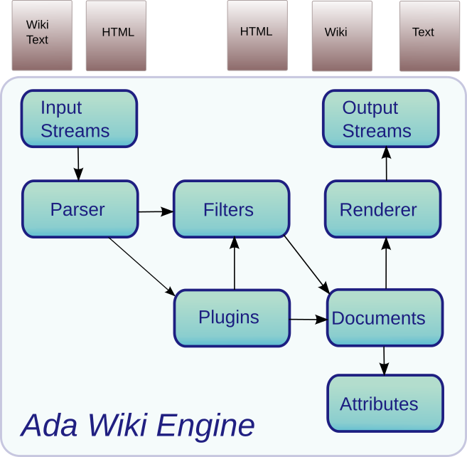

# Wiki
The Wiki engine parses a Wiki text in several Wiki syntax such as `MediaWiki`,
`Creole`, `Markdown`, `Dotclear` and renders the result either in HTML, text or into
another Wiki format.  The Wiki engine is used in two steps:

* The Wiki text is parsed according to its syntax to produce a Wiki Document instance.

* The Wiki document is then rendered by a renderer to produce the final HTML, text.

Through this process, it is possible to insert filters and plugins to customize the
parsing and the rendering.



The Ada Wiki engine is organized in several packages:

* The [Wiki Streams](#wiki-streams) packages define the interface, types and operations
 for the Wiki engine to read the Wiki or HTML content and for the Wiki renderer to generate
 the HTML or text outputs.

* The [Wiki parser](#wiki-parsers) is responsible for parsing HTML or Wiki content
 according to a selected Wiki syntax.  It builds the final Wiki document through filters
 and plugins.

* The [Wiki Filters](#wiki-filters) provides a simple filter framework that allows to plug
 specific filters when a Wiki document is parsed and processed.  Filters are used for the
 table of content generation, for the HTML filtering, to collect words or links
 and so on.

* The [Wiki Plugins](#wiki-plugins) defines the plugin interface that is used
 by the Wiki engine to provide pluggable extensions in the Wiki.  Plugins are used
 for the Wiki template support, to hide some Wiki text content when it is rendered
 or to interact with other systems.

* The Wiki documents and attributes are used for the representation of the Wiki
 document after the Wiki content is parsed.

* The [Wiki renderers](@wiki-render) are the last packages which are used for the rendering
 of the Wiki document to produce the final HTML or text.

## Parsing and rendering example

### Parsing a Wiki Document

To render a Wiki text you will first need to parse the Wiki text and produce a Wiki document instance.
For this you will need to declare the Wiki document instance and the Wiki parser instance:

```
 with Wiki.Documents;
 with Wiki.Parsers;
 ...
    Doc      : Wiki.Documents.Document;
    Engine   : Wiki.Parsers.Parser;
```

The [Ada Wiki Engine](https://github.com/stcarrez/ada-wiki) has a filter mechanism that
is used while parsing the input and before building the target wiki document instance.
Filters are chained together and a filter can do some work on the content it sees such as
blocking some content (filtering), collecting some data and doing some transformation on
the content.  When you want to use a filter, you have to declare an instance of the
corresponding filter type.

```
 with Wiki.Filters.Html;
 with Wiki.Filters.Autolink;
 with Wiki.Filters.TOC;
 ...
    Filter   : aliased Wiki.Filters.Html.Html_Filter_Type;
    Autolink : aliased Wiki.Filters.Autolink.Autolink_Filter;
    TOC      : aliased Wiki.Filters.TOC.TOC_Filter;
```

We use the `Autolink` filter that detects links in the text and transforms them into real links.
The `TOC` filter is used to collect header sections in the Wiki text and builds a table of content.
The `Html` filter is used to filter HTML content that could be contained in a Wiki text.
By default it ignores several HTML tags such as html, head, body, title, meta (these tags are silently discarded).
Furthermore it has the ability to hide several elements such as style and script (the tag and its content is discarded).

You will then configure the Wiki engine to build the filter chain and then define the Wiki syntax that the parser must use:

```
 Engine.Add_Filter (TOC'Unchecked_Access);
 Engine.Add_Filter (Autolink'Unchecked_Access);
 Engine.Add_Filter (Filter'Unchecked_Access);
 Engine.Set_Syntax (Syntax);
```

The Wiki engine gets its input from an `Input_Stream` interface that only defines a `Read`
procedure.  The [Ada Wiki Engine](https://github.com/stcarrez/ada-wiki) provides several
implementations of that interface, one of them is based on the Ada `Text_IO` package.
This is what we are going to use:

```
 with Wiki.Streams.Text_IO;
 ...
    Input    : aliased Wiki.Streams.Text_IO.File_Input_Stream;
```

You will then open the input file.  If the file contains UTF-8 characters, you may open it as follows:

```
 Input.Open (File_Path, "WCEM=8");
```

where `File_Path` is a string that represents the file's path.

Once the Wiki engine is setup and the input file opened, you can parse the Wiki text and build the Wiki document:

```
 Engine.Parse (Input'Unchecked_Access, Doc);
```

### Rendering a Wiki Document

After parsing a Wiki text you get a `Wiki.Documents.Document` instance that you can use as many times
as you want.  To render the Wiki document, you will first choose a renderer according to the target format
that you need.  The [Ada Wiki Engine](https://github.com/stcarrez/ada-wiki) provides three renderers:

* A Text renderer that produces text outputs,
* A HTML renderer that generates an HTML presentation for the document,
* A Wiki renderer that generates various Wiki syntaxes.

The renderer needs an output stream instance.  We are using the `Text_IO` implementation:

```
 with Wiki.Stream.Html.Text_IO;
 with Wiki.Render.Html;
 ...
    Output   : aliased Wiki.Streams.Html.Text_IO.Html_File_Output_Stream;
    Renderer : aliased Wiki.Render.Html.Html_Renderer;
```

You will then configure the renderer to tell it the output stream to use. You may enable or not
the rendering of Table Of Content and you just use the `Render` procedure to render the document.

```
 Renderer.Set_Output_Stream (Output'Unchecked_Access);
 Renderer.Set_Render_TOC (True);
 Renderer.Render (Doc);
```

By default the output stream is configured to write on the standard output.  This means that when
`Render` is called, the output will be written to the standard output.  You can choose another
output stream or open the output stream to a file according to your needs.


## Documents
The `Document` type is used to hold a Wiki document that was parsed by the parser
with one of the supported syntax.  The `Document` holds two distinct parts:

* A main document body that represents the Wiki content that was parsed.

* A table of contents part that was built while Wiki sections are collected.

Most of the operations provided by the `Wiki.Documents` package are intended to
be used by the wiki parser and filters to build the document.  The document is made of
nodes whose knowledge is required by the renderer.

A document instance must be declared before parsing a text:

```Ada
 Doc    : Wiki.Documents.Document;
```

After parsing some HTML or Wiki text, it will contain a representation of the
HTML or Wiki text.  It is possible to populate the document by using one of
the `Append`, `Add_Link`, `Add_Image` operation.
## Attributes
The `Attributes` package defines a simple management of attributes for
the wiki document parser.  Attribute lists are described by the `Attribute_List`
with some operations to append or query for an attribute.  Attributes are used for
the Wiki document representation to describe the HTML attributes that were parsed and
several parameters that describe Wiki content (links, ...).

The Wiki filters and Wiki plugins have access to the attributes before they are added
to the Wiki document.  They can check them or modify them according to their needs.

The Wiki renderers use the attributes to render the final HTML content.
## Wiki Parsers {#wiki-parsers}
The `Wikis.Parsers` package implements a parser for several well known wiki formats
but also for HTML.  While reading the input, the parser populates a wiki `Document`
instance with headers, paragraphs, links, and other elements.

```Ada
 Engine : Wiki.Parsers.Parser;
```

Before using the parser, it must be configured to choose the syntax by using the
`Set_Syntax` procedure:

```Ada
Engine.Set_Syntax (Wiki.SYNTAX_HTML);
```

The parser can be configured to use filters.  A filter is added by using the
`Add_Filter` procedure.  A filter is added at begining of the chain so that
the filter added last is called first.  The wiki `Document` is always built through
the filter chain so this allows filters to change or alter the content that was parsed.

```Ada
Engine.Add_Filter (TOC'Unchecked_Access);
Engine.Add_Filter (Filter'Unchecked_Access);
```

The `Parse` procedure is then used to parse either a string content or some stream
represented by the `Input_Stream` interface.  After the `Parse` procedure
completes, the `Document` instance holds the wiki document.

```Ada
Engine.Parse (Some_Text, Doc);
```
## Filters
The `Wiki.Filters` package provides a simple filter framework that allows to plug
specific filters when a wiki document is parsed and processed.  The `Filter_Type`
implements the operations that the `Wiki.Parsers` will use to populate the document.
A filter can do some operations while calls are made so that it can:

* Get the text content and filter it by looking at forbidden words in some dictionary,

* Ignore some formatting construct (for example to forbid the use of links),

* Verify and do some corrections on HTML content embedded in wiki text,

* Expand some plugins, specific links to complex content.

To implement a new filter, the `Filter_Type` type must be used as a base type
and some of the operations have to be overridden.  The default `Filter_Type` operations
just propagate the call to the attached wiki document instance (ie, a kind of pass
through filter).

### TOC Filter
The `TOC_Filter` is a filter used to build the table of contents.
It collects the headers with the section level as they are added to the
wiki document.  The TOC is built in the wiki document as a separate node
and it can be retrieved by using the `Get_TOC` function.  To use
the filter, declare an aliased instance:

```Ada
 TOC : aliased Wiki.Filters.TOC.TOC_Filter;
```

and add the filter to the Wiki parser engine:

```Ada
 Engine.Add_Filter (TOC'Unchecked_Access);
```
### HTML Filters
The `Wiki.Filters.Html` package implements a customizable HTML filter that verifies
the HTML content embedded in the Wiki text.  The HTML filter can be customized to indicate
the HTML tags that must be accepted or ignored.  By default, the filter accepts all HTML
tags except 'script', 'noscript', 'style'.

* A tag can be `Forbidden` in which case it is not passed to the document.
 If this tag contains inner HTML elements, they are passed to the document.
 By default, the `html`, `head`, `meta`, `title`, `script`, `body` are not
 passed to the document.

* A tag can be `Hidden` in which case it is not passed to the document and
 the inner HTML elements it contains are also silently ignored.
 By default this is the case for `script`, `noscript` and `style`.

The HTML filter may be declared and configured as follows:

```Ada
F : aliased Wiki.Filters.Html.Html_Filter_Type;
...
F.Forbidden (Wiki.Filters.Html.A_TAG);
```

With this configuration the HTML links will be ignored by the parser.
The following configuration:

```Ada
F.Hide (Wiki.Filters.Html.TABLE_TAG);
```

will remove the table and its content.

The filter is added to the Wiki parser filter chain by using the <tt>Add_Filter</tt>
operation:

```Ada
Engine.Add_Filter (F'Unchecked_Access);

```
### Collector Filters
The `Wiki.Filters.Collectors` package defines three filters that can be used to
collect words, links or images contained in a Wiki document.  The collector filters are
inserted in the filter chain and they collect the data as the Wiki text is parsed.
After the parsing, the collector filters have collected either the words or the links
and they can be queried by using the `Find` or `Iterate` operations.
The following collectors are defined:

* The `Word_Collector_Type` collects words from text, headers, links,

* The `Link_Collector_Type` collects links,

* The `Image_Collector_Type` collects images,

The filter is inserted in the filter chain before parsing the Wiki document.

```Ada
Words : aliased Wiki.Filters.Collectors.Word_Collector_Type;
...
Engine.Add_Filter (Words'Unchecked_Access);
```

Once the document is parsed, the collector filters contains the data that was collected.
The `Iterate` procedure can be used to have a procedure called for each value
collected by the filter.

```Ada
Words.Iterate (Print'Access);
```
### Autolink Filters
The `Wiki.Filters.Autolink` package defines a filter that transforms URLs
in the Wiki text into links.  The filter should be inserted in the filter chain
after the HTML and after the collector filters.  The filter looks for the
text and transforms `http://`, `https://`, `ftp://` and `ftps://` links into real links.
When such links are found, the text is split so that next filters see only the text without
links and the `Add_Link` filter operations are called with the link.
### Variables Filters
The `Wiki.Filters.Variables` package defines a filter that replaces variables
in the text, links, quotes.  Variables are represented as `$name`, `$(name)`
or `${name}`.  When a variable is not found, the original string is not modified.
The list of variables is either configured programatically through the
`Add_Variable` procedures but it can also be set from the Wiki text by using
the `Wiki.Plugins.Variables` plugin.

The variable filter must be configured with the plugin by declaring the instance:

```Ada
F : aliased Wiki.Filters.Html.Html_Filter_Type;
 Engine.Add_Filter (F'Unchecked_Access);

```

And variables can be inserted by using the `Add_Variable` procedure:

```Ada
F.Add_Variable ("username", "gandalf");
```
## Plugins {#wiki-plugins}
The `Wiki.Plugins` package defines the plugin interface that is used by the wiki
engine to provide pluggable extensions in the Wiki.  The plugins works by using
a factory that finds and gives access to a plugin given its name.
The plugin factory is represented by the `Wiki_Plugin` limited interface which
must only implement the `Find` function.  A simple plugin factory can be created
by declaring a tagged record that implements the interface:

```Ada
type Factory is new Wiki.Plugins.Plugin_Factory with null record;
overriding function
Find (Factory : in Factory;
      Name    : in String) return Wiki.Plugins.Wiki_Plugin_Access;
```

### Variables Plugins
The `Wiki.Plugins.Variables` package defines a the variables plugin that allows
to set or update a variable that will be replaced by the `Wiki.Filters.Variables` filter.
### Conditions Plugins
The <b>Wiki.Plugins.Conditions</b> package defines a set of conditional plugins
to show or hide wiki content according to some conditions evaluated during the parsing phase.

### Template Plugins
The `Wiki.Plugins.Templates` package defines an abstract template plugin.
To use the template plugin, the `Get_Template` procedure must be implemented.
It is responsible for getting the template content according to the plugin parameters.

## Wiki Renderer {#wiki-render}
The `Wiki.Render` package represents the renderer that takes a wiki document
and render the result either in text, HTML or another format.

### HTML Renderer
The `Html_Renderer` allows to render a wiki document into an HTML content.

### Link Renderer
The <tt>Wiki.Render.Links</tt> package defines the <tt>Link_Renderer</tt> interface used
for the rendering of links and images.  The interface allows to customize the generated
links and image source for the final HTML.

### Text Renderer
The `Text_Renderer` allows to render a wiki document into a text content.
The formatting rules are ignored except for the paragraphs and sections.
### Wiki Renderer
The `Wiki_Renderer</tt> allows to render a wiki document into another wiki content.
The formatting rules are ignored except for the paragraphs and sections.
## Input and Output streams {#wiki-streams}
The `Wiki.Streams` package defines the interfaces used by
the parser or renderer to read and write their outputs.

The `Input_Stream` interface defines the interface that must be implemented to
read the source Wiki content.  The `Read` procedure is called by the parser
repeatedly while scanning the Wiki content.

The `Output_Stream` interface is the interface used by the renderer
to write their outputs.  It defines the `Write` procedure to write
a single character or a string.

### HTML Output Stream
The `Wiki.Writers` package defines the interfaces used by the renderer to write
their outputs.

The `Input_Stream` interface defines the interface that must be implemented to
read the source Wiki content.  The `Read` procedure is called by the parser
repeatedly while scanning the Wiki content.
### Output Builder Stream
The <tt>Output_Builder_Stream</tt> is a concrete in-memory output stream.
It collects the output in a <tt>Wiki.Strings.Bstring</tt> object and the
content can be retrieved at the end by using the <tt>To_String</tt>
or <tt>Iterate</tt> operation.
### HTML Output Builder Stream
The `Html_Output_Builder_Stream` type defines a HTML output stream that collects the
HTML into expandable buffers.  Once the complete HTML document is rendered, the content is
retrieved either by the `To_String` or the `Iterate` operations.

### Text_IO Input and Output streams
The `Wiki.Streams.Text_IO` package defines the `File_Input_Stream` and
the `File_Output_Stream` types which use the `Ada.Wide_Wide_Text_IO` package
to read or write the output streams.

By default the `File_Input_Stream` is configured to read the standard input.
The `Open` procedure can be used to read from a file knowing its name.

The `File_Output_Stream` is configured to write on the standard output.
The `Open` and `Create` procedure can be used to write on a file.


